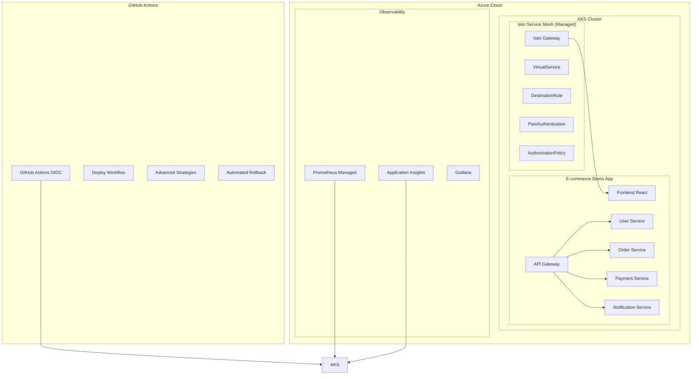

# 🚀 Istio AKS Templates - Arquitetura de Referência Empresarial

[](https://opensource.org/licenses/MIT)
[](https://kubernetes.io/)
[](https://istio.io/)
[](https://azure.microsoft.com/services/kubernetes-service/)

> **Solução completa de Service Mesh para ambientes empresariais com máxima resiliência, segurança e observabilidade**

## 🎯 Visão Geral

Esta é uma **arquitetura de referência de altíssimo nível** para implementação do Istio gerenciado no Azure Kubernetes Service (AKS) com Prometheus gerenciado. A solução oferece templates reutilizáveis, automação completa via GitHub Actions e estratégias avançadas de deployment que combinam **A/B Testing**, **Blue/Green** e **Canary** simultaneamente.

### 🏆 Diferenciais Únicos

- **🔄 Estratégias Combinadas**: A/B Testing + Blue/Green + Canary em uma única configuração
- **🤖 Rollback Automático**: Baseado em métricas de SLO/SLI em tempo real
- **🛡️ Zero Trust Security**: mTLS STRICT e políticas de autorização granulares
- **📊 Observabilidade Avançada**: Telemetria v2 com métricas customizadas de negócio
- **⚡ Máxima Resiliência**: Circuit breakers, retry policies e outlier detection
- **🎪 Demonstração Interativa**: Aplicação e-commerce completa para showcases

## 🏗️ Arquitetura da Solução



## 📁 Estrutura do Repositório

```
istio-aks-templates/
├── 📂 templates/                           # Templates YAML reutilizáveis
│   ├── 📂 base/                           # Componentes básicos
│   │   ├── gateway.yaml                   # Istio Gateway básico
│   │   ├── virtual-service.yaml          # VirtualService básico
│   │   └── advanced-gateway.yaml         # Gateway avançado com TLS
│   ├── 📂 security/                       # Configurações de segurança
│   │   ├── peer-authentication.yaml      # mTLS STRICT
│   │   ├── authorization-policy.yaml     # Políticas de autorização
│   │   ├── namespace-security-policy.yaml # Segurança por namespace
│   │   └── rate-limiting-envoyfilter.yaml # Rate limiting avançado
│   ├── 📂 traffic-management/             # Gerenciamento de tráfego
│   │   ├── destination-rule.yaml         # DestinationRule básico
│   │   ├── advanced-destination-rule.yaml # Circuit breakers avançados
│   │   └── advanced-virtual-service.yaml # Roteamento inteligente
│   ├── 📂 observability/                  # Observabilidade
│   │   ├── telemetry.yaml                # Telemetria básica
│   │   ├── advanced-telemetry.yaml       # Telemetria v2 avançada
│   │   └── prometheus-scrape-config.yaml # Configuração Prometheus
│   └── 📂 deployment-strategies/          # Estratégias de deployment
│       ├── ab-bluegreen-combined.yaml    # A/B + Blue/Green
│       └── ab-bluegreen-canary-combined.yaml # A/B + Blue/Green + Canary
├── 📂 .github/workflows/                  # Automação GitHub Actions
│   ├── deploy-ecommerce.yml              # Deploy da aplicação demo
│   ├── advanced-deployment-strategies.yml # Estratégias avançadas
│   └── automated-rollback.yml            # Rollback automático
├── 📂 demo-app/                          # Aplicação de demonstração
│   ├── 📂 k8s-manifests/                 # Manifestos Kubernetes
│   └── README.md                         # Documentação da demo
├── 📂 scripts/                           # Scripts utilitários
│   ├── render.sh                         # Renderizador de templates
│   ├── validate-all.sh                   # Validação completa
│   ├── deploy-manual.sh                  # Deploy manual
│   └── demo-presentation.sh              # Script de apresentação
├── 📂 docs/                              # Documentação
│   └── ARCHITECTURE.md                   # Arquitetura detalhada
└── 📂 examples/                          # Exemplos de uso
    └── production-ready/                 # Configurações para produção
```

## 🚀 Quick Start

### 1️⃣ Pré-requisitos

- **Azure AKS** com Istio gerenciado habilitado
- **Azure Monitor for Prometheus** configurado
- **GitHub repository** com OIDC configurado para Azure
- **kubectl** configurado para acessar o cluster

### 2️⃣ Configuração Inicial

```bash
# Clone o repositório
git clone https://github.com/ricardo2009/istio-aks-templates.git
cd istio-aks-templates

# Torne os scripts executáveis
chmod +x scripts/*.sh

# Valide todos os templates
./scripts/validate-all.sh
```

### 3️⃣ Deploy da Aplicação Demo

#### Via GitHub Actions (Recomendado)

1. Configure os secrets no GitHub:
   - `AZURE_CLIENT_ID`
   - `AZURE_TENANT_ID` 
   - `AZURE_SUBSCRIPTION_ID`

2. Execute o workflow "🚀 Deploy E-commerce Platform":
   - Acesse Actions → Deploy E-commerce Platform
   - Selecione "deploy" como ação
   - Escolha o ambiente (demo/staging/production)

#### Via Deploy Manual

```bash
# Deploy completo da aplicação e-commerce
./scripts/deploy-manual.sh

# Ou renderize templates específicos
./scripts/render.sh -f templates/base/advanced-gateway.yaml \
  -s frontend -n ecommerce-demo -h app.example.com

./scripts/render.sh -f templates/deployment-strategies/ab-bluegreen-canary-combined.yaml \
  -s order-service -n ecommerce-demo \
  --active-environment green --canary-weight 10 --experimental-weight 15
```

## 🎪 Estratégias de Deployment Avançadas

### 🔄 Estratégia Ultimate: A/B + Blue/Green + Canary

Nossa estratégia mais avançada combina três abordagens simultaneamente:

```yaml
# Exemplo de configuração
apiVersion: networking.istio.io/v1beta1
kind: VirtualService
metadata:
  name: order-service-ultimate-vs
spec:
  http:
  # Prioridade 1: Usuários canary (100% nova versão)
  - match:
    - headers:
        canary-user: { exact: "true" }
    route:
    - destination:
        subset: green-canary
      weight: 100
  
  # Prioridade 2: Usuários beta (A/B testing)
  - match:
    - headers:
        user-type: { exact: "beta" }
    route:
    - destination:
        subset: green-experimental
      weight: 100
  
  # Prioridade 3: Usuários premium (A/B + Canary)
  - match:
    - headers:
        user-tier: { exact: "premium" }
    route:
    - destination:
        subset: green-stable
      weight: 70
    - destination:
        subset: green-experimental
      weight: 20
    - destination:
        subset: green-canary
      weight: 10
  
  # Tráfego padrão (distribuição controlada)
  - route:
    - destination:
        subset: green-stable
      weight: 85
    - destination:
        subset: green-experimental
      weight: 10
    - destination:
        subset: green-canary
      weight: 5
```

### 🤖 Rollback Automático Inteligente

O sistema monitora continuamente as métricas e executa rollback automático quando:

- **Taxa de sucesso** < 95%
- **Latência P95** > 1000ms
- **Taxa de erro** > 5%
- **Uso de CPU** > 80%
- **Uso de memória** > 85%
- **Circuit breaker** ativado

```bash
# Execute o monitoramento contínuo
gh workflow run automated-rollback.yml \
  --field service=order-service \
  --field monitoring_duration=10 \
  --field success_rate_threshold=0.95
```

## 🛡️ Segurança Zero Trust

### mTLS STRICT Automático

```yaml
apiVersion: security.istio.io/v1beta1
kind: PeerAuthentication
metadata:
  name: default
  namespace: ecommerce-demo
spec:
  mtls:
    mode: STRICT
```

### Políticas de Autorização Granulares

```yaml
apiVersion: security.istio.io/v1beta1
kind: AuthorizationPolicy
metadata:
  name: payment-service-policy
spec:
  selector:
    matchLabels:
      app: payment-service
  rules:
  - from:
    - source:
        principals: ["cluster.local/ns/ecommerce-demo/sa/api-gateway"]
  - to:
    - operation:
        methods: ["POST"]
        paths: ["/api/payments/*"]
```

## 📊 Observabilidade Avançada

### Métricas Customizadas de Negócio

```yaml
apiVersion: telemetry.istio.io/v1alpha1
kind: Telemetry
metadata:
  name: business-metrics
spec:
  metrics:
  - overrides:
    - match:
        metric: requests_total
      tagOverrides:
        conversion_event:
          value: "%{RESPONSE_HEADERS['x-conversion-event']}"
        user_segment:
          value: "%{REQUEST_HEADERS['user-type']}"
        ab_test_group:
          value: "%{RESPONSE_HEADERS['x-ab-test-group']}"
```

### Dashboards Pré-configurados

- **Service Mesh Overview**: Visão geral do mesh
- **Deployment Strategies**: Métricas de A/B, Blue/Green, Canary
- **Security Dashboard**: mTLS, políticas de autorização
- **Business Metrics**: Conversões, segmentos de usuário
- **SLO/SLI Monitoring**: Indicadores de nível de serviço

## 🎯 Casos de Uso Empresariais

### 1. **E-commerce Platform** (Demonstração Incluída)
- Frontend React com micro-frontends
- API Gateway com roteamento inteligente
- Microserviços de usuário, pedidos, pagamentos
- A/B testing para features de conversão

### 2. **Financial Services**
- Canary deployment para serviços críticos
- mTLS STRICT para compliance
- Rate limiting por cliente/API key
- Rollback automático baseado em SLA

### 3. **Healthcare Applications**
- Blue/Green para zero downtime
- Políticas de autorização RBAC
- Audit trail completo
- Disaster recovery automatizado

## 🔧 Configurações Avançadas

### Circuit Breakers Inteligentes

```yaml
trafficPolicy:
  outlierDetection:
    consecutiveGatewayErrors: 3
    consecutive5xxErrors: 3
    interval: 30s
    baseEjectionTime: 30s
    maxEjectionPercent: 50
    minHealthPercent: 30
```

### Rate Limiting Dinâmico

```yaml
# Por IP
- match:
    headers:
      x-forwarded-for: { regex: ".*" }
  rate_limits:
  - actions:
    - generic_key:
        descriptor_value: "per-ip"
    - remote_address: {}

# Por usuário autenticado
- match:
    headers:
      authorization: { regex: "Bearer .*" }
  rate_limits:
  - actions:
    - header_value_match:
        descriptor_value: "authenticated-user"
        headers:
        - name: "user-id"
```

## 📈 Métricas e SLOs

### Service Level Objectives (SLOs)

| Serviço | Disponibilidade | Latência P95 | Taxa de Erro |
|---------|----------------|--------------|--------------|
| Frontend | 99.9% | < 200ms | < 0.1% |
| API Gateway | 99.95% | < 100ms | < 0.05% |
| Payment Service | 99.99% | < 500ms | < 0.01% |
| Order Service | 99.9% | < 300ms | < 0.1% |

### Alertas Automáticos

- **Crítico**: SLO violado por > 5 minutos
- **Warning**: Degradação de performance detectada
- **Info**: Deployment strategy executada com sucesso

## 🚀 Execução de Workflows

### Deploy Completo

```bash
# Via GitHub Actions
gh workflow run deploy-ecommerce.yml \
  --field action=deploy \
  --field environment=demo

# Via script local
./scripts/deploy-manual.sh --environment demo --full-deploy
```

### Estratégias Avançadas

```bash
# Canary Deployment
gh workflow run advanced-deployment-strategies.yml \
  --field strategy=canary \
  --field service=order-service \
  --field new_version=v2.1.0 \
  --field traffic_percentage=10

# Blue/Green Deployment
gh workflow run advanced-deployment-strategies.yml \
  --field strategy=blue-green \
  --field service=payment-service \
  --field new_version=v2.1.0

# A/B Testing
gh workflow run advanced-deployment-strategies.yml \
  --field strategy=ab-testing \
  --field service=user-service \
  --field new_version=v2.1.0 \
  --field traffic_percentage=20
```

### Monitoramento e Rollback

```bash
# Monitoramento contínuo
gh workflow run automated-rollback.yml \
  --field service=order-service \
  --field monitoring_duration=15

# Rollback manual
gh workflow run advanced-deployment-strategies.yml \
  --field strategy=canary \
  --field service=order-service \
  --field action=rollback
```

## 🎪 Demonstração para Clientes

### Script de Apresentação Interativo

```bash
# Execute a demonstração completa
./scripts/demo-presentation.sh

# Opções disponíveis:
# 1. Deploy da aplicação e-commerce
# 2. Demonstração de estratégias de deployment
# 3. Teste de resiliência (chaos engineering)
# 4. Rollback automático
# 5. Métricas e observabilidade
# 6. Cleanup completo
```

### Cenários de Demonstração

1. **Deploy Zero Downtime**: Blue/Green com aplicação real
2. **A/B Testing**: Comparação de conversões entre versões
3. **Canary Rollout**: Rollout gradual com monitoramento
4. **Chaos Engineering**: Injeção de falhas e recuperação
5. **Rollback Automático**: Detecção e correção automática
6. **Security Showcase**: mTLS e políticas de autorização

## 🔍 Troubleshooting

### Problemas Comuns

#### 1. Erro de Autenticação OIDC
```bash
# Verifique as configurações
az ad app show --id $AZURE_CLIENT_ID
kubectl get secrets -n kube-system
```

#### 2. Templates não renderizam
```bash
# Valide a sintaxe
./scripts/validate-all.sh
yamllint templates/
```

#### 3. Istio não funciona
```bash
# Verifique o status do Istio
kubectl get pods -n aks-istio-system
kubectl get gateway,virtualservice,destinationrule -A
```

### Logs e Debugging

```bash
# Logs do Istio
kubectl logs -n aks-istio-system -l app=istiod

# Métricas do Envoy
kubectl exec -it <pod> -c istio-proxy -- curl localhost:15000/stats

# Configuração do Envoy
kubectl exec -it <pod> -c istio-proxy -- curl localhost:15000/config_dump
```

## 🤝 Contribuição

### Como Contribuir

1. Fork o repositório
2. Crie uma branch para sua feature (`git checkout -b feature/nova-funcionalidade`)
3. Commit suas mudanças (`git commit -am 'Adiciona nova funcionalidade'`)
4. Push para a branch (`git push origin feature/nova-funcionalidade`)
5. Abra um Pull Request

### Padrões de Código

- **YAML**: Use 2 espaços para indentação
- **Scripts**: Siga o padrão bash strict mode (`set -euo pipefail`)
- **Documentação**: Mantenha o README atualizado
- **Testes**: Valide todos os templates antes do commit

## 📚 Recursos Adicionais

### Documentação Oficial

- [Istio Documentation](https://istio.io/latest/docs/)
- [Azure AKS Istio](https://docs.microsoft.com/en-us/azure/aks/istio-about)
- [Azure Monitor for Prometheus](https://docs.microsoft.com/en-us/azure/azure-monitor/containers/prometheus-metrics-enable)

### Treinamentos e Certificações

- [Istio Certified Associate](https://training.linuxfoundation.org/certification/istio-certified-associate-ica/)
- [Azure Kubernetes Service](https://docs.microsoft.com/en-us/learn/paths/intro-to-kubernetes-on-azure/)
- [Service Mesh Fundamentals](https://academy.tetrate.io/)

## 📄 Licença

Este projeto está licenciado sob a Licença MIT - veja o arquivo [LICENSE](LICENSE) para detalhes.

## 🏆 Reconhecimentos

- **Microsoft Azure Team** - Suporte ao Istio gerenciado no AKS
- **Istio Community** - Desenvolvimento do service mesh
- **CNCF** - Padronização de tecnologias cloud native

---

**Desenvolvido com ❤️ para a comunidade DevOps e Cloud Native**

> 💡 **Dica**: Este repositório representa o estado da arte em arquitetura de Service Mesh para ambientes empresariais. Use-o como base para seus projetos de produção e adapte conforme suas necessidades específicas.

## 📞 Suporte

Para suporte técnico, dúvidas ou sugestões:

- 📧 **Email**: [ricardo.neves@gmail.com](mailto:ricardo.neves@gmail.com)
- 🐛 **Issues**: [GitHub Issues](https://github.com/ricardo2009/istio-aks-templates/issues)
- 💬 **Discussions**: [GitHub Discussions](https://github.com/ricardo2009/istio-aks-templates/discussions)

---

**🚀 Transforme sua arquitetura de microserviços com o poder do Istio no Azure!**
