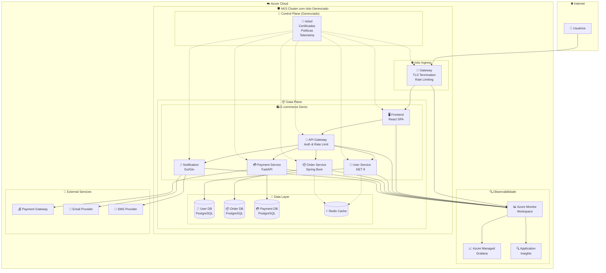
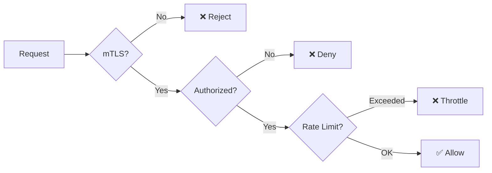
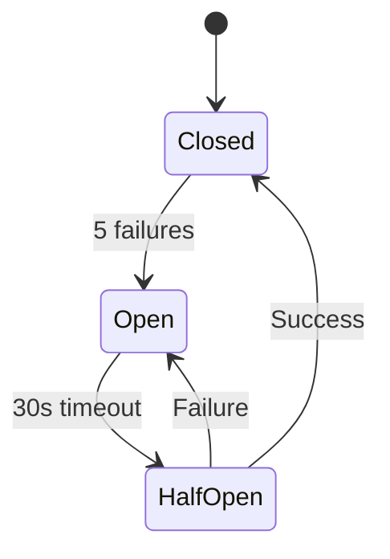

# 🚀 Istio Service Mesh - Arquitetura de Referência para AKS

[](https://github.com/ricardo2009/istio-aks-templates/actions/workflows/demo-ecommerce-platform.yml)
[](https://opensource.org/licenses/MIT)
[](https://azure.microsoft.com/services/kubernetes-service/)
[](https://istio.io/)
[](https://prometheus.io/)

> **Arquitetura de Referência Empresarial** para implementação de Service Mesh com **Istio Gerenciado no Azure Kubernetes Service (AKS)**, integrado com **Azure Monitor for Prometheus** e **Azure Managed Grafana**.

## 📋 Índice

- [🎯 Visão Geral](#-visão-geral)
- [🏗️ Arquitetura](#️-arquitetura)
- [✨ Características](#-características)
- [🚀 Quick Start](#-quick-start)
- [📁 Estrutura do Projeto](#-estrutura-do-projeto)
- [🛠️ Templates Reutilizáveis](#️-templates-reutilizáveis)
- [🤖 Automação GitHub Actions](#-automação-github-actions)
- [🎪 Demonstração E-commerce](#-demonstração-e-commerce)
- [📊 Observabilidade](#-observabilidade)
- [🔒 Segurança](#-segurança)
- [⚡ Resiliência](#-resiliência)
- [📈 Performance](#-performance)
- [🔧 Configuração](#-configuração)
- [📚 Documentação](#-documentação)
- [🤝 Contribuição](#-contribuição)

## 🎯 Visão Geral

Esta solução fornece uma **arquitetura de referência completa** para implementação de Service Mesh em ambientes empresariais, utilizando o **Istio gerenciado pelo Azure** em clusters AKS. A solução foi projetada por arquitetos sêniores para atender aos mais altos padrões de **segurança**, **resiliência** e **observabilidade**.

### 🎪 Demonstração Interativa

Desenvolvemos uma **plataforma de e-commerce completa** que demonstra todos os aspectos avançados do Istio em ação:

- **Circuit Breakers** em tempo real
- **Canary Deployments** automatizados
- **Chaos Engineering** controlado
- **mTLS** e **Zero Trust** security
- **Rate Limiting** inteligente
- **Distributed Tracing** completo

## 🏗️ Arquitetura



## ✨ Características

### 🛡️ **Segurança Zero Trust**
- **mTLS Strict** por padrão em toda a malha
- **Políticas de Autorização** granulares por serviço
- **Rate Limiting** inteligente por IP, usuário e API key
- **Integração com Azure AD** via Workload Identity
- **Auditoria completa** de tentativas de acesso

### ⚡ **Resiliência Máxima**
- **Circuit Breakers** configuráveis por serviço
- **Retry Policies** com backoff exponencial
- **Timeout Policies** otimizadas
- **Outlier Detection** automática
- **Chaos Engineering** integrado

### 📊 **Observabilidade Completa**
- **Métricas automáticas** via Azure Monitor for Prometheus
- **Distributed Tracing** com Azure Application Insights
- **Access Logs** estruturados do Envoy
- **Custom Metrics** de negócio
- **Dashboards** pré-configurados no Grafana

### 🚀 **Deployments Avançados**
- **Canary Deployments** automatizados
- **Blue-Green Deployments** sem downtime
- **A/B Testing** baseado em headers
- **Feature Flags** via roteamento
- **Rollback automático** baseado em métricas

### 🎯 **Templates Reutilizáveis**
- **Sem dependência do Helm** - templates YAML puros
- **Parametrização completa** via variáveis
- **Versionamento** de configurações
- **Validação automática** via GitHub Actions
- **Documentação** inline nos templates

## 🚀 Quick Start

### 📋 Pré-requisitos

1. **Azure Subscription** com permissões de Contributor
2. **AKS Cluster** com Istio Add-on habilitado
3. **Azure Monitor for Prometheus** configurado
4. **GitHub Repository** com OIDC configurado

### ⚙️ Configuração Inicial

1. **Clone o repositório**:
```bash
git clone https://github.com/ricardo2009/istio-aks-templates.git
cd istio-aks-templates
```

2. **Configure os secrets do GitHub**:
```bash
# No seu repositório GitHub, configure:
AZURE_CLIENT_ID=<seu-client-id>
AZURE_TENANT_ID=<seu-tenant-id>
AZURE_SUBSCRIPTION_ID=<seu-subscription-id>
```

3. **Execute a demonstração**:
   - Vá para **Actions** → **🚀 Deploy E-commerce Platform Demo**
   - Clique em **Run workflow**
   - Selecione **Action**: `deploy`
   - Clique em **Run workflow**

### 🎪 Demonstração Completa

A demonstração inclui cenários automatizados para:

| Cenário | Descrição | Duração |
|---------|-----------|---------|
| **🚀 Deploy** | Implantação completa da plataforma | ~5 min |
| **🐤 Canary** | Deploy canary com monitoramento | ~10 min |
| **🔥 Chaos** | Testes de resiliência | ~5 min |
| **🏋️ Load Test** | Testes de carga | ~10 min |
| **🗑️ Destroy** | Limpeza completa | ~2 min |

## 📁 Estrutura do Projeto

```
istio-aks-templates/
├── 📁 .github/workflows/          # GitHub Actions
│   ├── demo-ecommerce-platform.yml    # Demonstração principal
│   ├── apply-istio-config.yml          # Aplicar configurações
│   ├── remove-istio-config.yml         # Remover configurações
│   └── setup-monitoring.yml            # Configurar observabilidade
├── 📁 templates/                  # Templates Istio reutilizáveis
│   ├── 📁 base/                       # Gateway, VirtualService básicos
│   │   ├── gateway.yaml
│   │   ├── virtual-service.yaml
│   │   └── advanced-gateway.yaml
│   ├── 📁 security/                   # Segurança e políticas
│   │   ├── peer-authentication.yaml
│   │   ├── authorization-policy.yaml
│   │   ├── namespace-security-policy.yaml
│   │   └── rate-limiting-envoyfilter.yaml
│   ├── 📁 traffic-management/         # Gerenciamento de tráfego
│   │   ├── destination-rule.yaml
│   │   ├── advanced-destination-rule.yaml
│   │   └── advanced-virtual-service.yaml
│   └── 📁 observability/              # Telemetria e monitoramento
│       ├── telemetry.yaml
│       ├── advanced-telemetry.yaml
│       └── prometheus-scrape-config.yaml
├── 📁 demo-app/                   # Aplicação de demonstração
│   ├── README.md                      # Documentação da demo
│   ├── 📁 k8s-manifests/             # Manifestos Kubernetes
│   ├── 📁 frontend/                   # Frontend React
│   ├── 📁 api-gateway/               # API Gateway Node.js
│   ├── 📁 user-service/              # User Service .NET
│   ├── 📁 order-service/             # Order Service Java
│   ├── 📁 payment-service/           # Payment Service Python
│   └── 📁 notification-service/      # Notification Service Go
├── 📁 scripts/                    # Scripts utilitários
│   └── render.sh                      # Renderizador de templates
├── 📁 docs/                       # Documentação
│   ├── ARCHITECTURE.md               # Arquitetura detalhada
│   ├── SECURITY.md                   # Guia de segurança
│   ├── OBSERVABILITY.md              # Guia de observabilidade
│   └── TROUBLESHOOTING.md            # Guia de troubleshooting
├── 📁 examples/                   # Exemplos de uso
│   ├── 📁 basic/                     # Configuração básica
│   ├── 📁 advanced/                  # Configuração avançada
│   └── 📁 production/                # Configuração de produção
└── README.md                      # Este arquivo
```

## 🛠️ Templates Reutilizáveis

### 🌐 **Gateway Avançado**
```yaml
# templates/base/advanced-gateway.yaml
apiVersion: networking.istio.io/v1alpha3
kind: Gateway
metadata:
  name: '{{GATEWAY_NAME}}'
  namespace: '{{NAMESPACE}}'
spec:
  selector:
    istio: '{{GATEWAY_SELECTOR}}'
  servers:
  - port:
      number: 443
      name: https
      protocol: HTTPS
    hosts:
    - '{{HOST}}'
    tls:
      mode: SIMPLE
      credentialName: '{{TLS_SECRET_NAME}}'
      minProtocolVersion: TLSV1_2
      maxProtocolVersion: TLSV1_3
```

### 🛡️ **Segurança Zero Trust**
```yaml
# templates/security/namespace-security-policy.yaml
apiVersion: security.istio.io/v1beta1
kind: PeerAuthentication
metadata:
  name: '{{NAMESPACE}}-default-mtls'
  namespace: '{{NAMESPACE}}'
spec:
  mtls:
    mode: STRICT
---
apiVersion: security.istio.io/v1beta1
kind: AuthorizationPolicy
metadata:
  name: '{{NAMESPACE}}-deny-all'
  namespace: '{{NAMESPACE}}'
spec:
  action: DENY
  rules:
  - from:
    - source:
        notPrincipals: ["cluster.local/ns/{{NAMESPACE}}/sa/*"]
```

### ⚡ **Circuit Breaker Avançado**
```yaml
# templates/traffic-management/advanced-destination-rule.yaml
apiVersion: networking.istio.io/v1alpha3
kind: DestinationRule
metadata:
  name: '{{SERVICE_NAME}}-advanced-dr'
  namespace: '{{NAMESPACE}}'
spec:
  host: '{{SERVICE_NAME}}.{{NAMESPACE}}.svc.cluster.local'
  trafficPolicy:
    connectionPool:
      tcp:
        maxConnections: {{MAX_CONNECTIONS | default(100)}}
      http:
        http1MaxPendingRequests: {{MAX_PENDING_REQUESTS | default(1024)}}
        maxRequestsPerConnection: {{MAX_REQUESTS_PER_CONN | default(10)}}
    outlierDetection:
      consecutive5xxErrors: {{CONSECUTIVE_5XX_ERRORS | default(5)}}
      interval: '{{OUTLIER_INTERVAL | default("10s")}}'
      baseEjectionTime: '{{BASE_EJECTION_TIME | default("30s")}}'
      maxEjectionPercent: {{MAX_EJECTION_PERCENT | default(50)}}
```

### 📊 **Telemetria Avançada**
```yaml
# templates/observability/advanced-telemetry.yaml
apiVersion: telemetry.istio.io/v1alpha1
kind: Telemetry
metadata:
  name: '{{NAMESPACE}}-advanced-telemetry'
  namespace: '{{NAMESPACE}}'
spec:
  metrics:
  - providers:
    - name: prometheus
  - overrides:
    - match:
        metric: requests_total
      tagOverrides:
        user_id:
          operation: UPSERT
          value: '%{REQUEST_HEADERS:x-user-id}'
        tenant_id:
          operation: UPSERT
          value: '%{REQUEST_HEADERS:x-tenant-id}'
  tracing:
  - providers:
    - name: azure-monitor
  - randomSamplingPercentage: 1.0
```

## 🤖 Automação GitHub Actions

### 🚀 **Deploy E-commerce Platform Demo**
Workflow principal que demonstra todos os recursos:

```yaml
name: 🚀 Deploy E-commerce Platform Demo
on:
  workflow_dispatch:
    inputs:
      action:
        type: choice
        options: [deploy, destroy, canary-deploy, rollback, chaos-test, load-test]
      environment:
        type: choice
        options: [demo, staging, production]
      canary_percentage:
        default: '10'
      chaos_scenario:
        type: choice
        options: [payment-latency, order-service-failure, network-partition]
```

### 📊 **Cenários de Demonstração**

| Workflow | Descrição | Uso |
|----------|-----------|-----|
| **🚀 Deploy** | Implantação completa da plataforma | Demonstração inicial |
| **🐤 Canary Deploy** | Deploy canary com monitoramento automático | Demonstrar deployments seguros |
| **🔥 Chaos Test** | Injeção de falhas controladas | Demonstrar resiliência |
| **🏋️ Load Test** | Testes de carga com Fortio | Demonstrar performance |
| **🗑️ Destroy** | Limpeza completa do ambiente | Cleanup após demo |

## 🎪 Demonstração E-commerce

### 🛍️ **Plataforma Completa**

Nossa aplicação de demonstração implementa uma plataforma de e-commerce real com:

- **Frontend**: React SPA com métricas de UX
- **API Gateway**: Node.js com rate limiting e auth
- **User Service**: .NET 8 com Entity Framework
- **Order Service**: Java Spring Boot para lógica de negócio
- **Payment Service**: Python FastAPI para integrações
- **Notification Service**: Go/Gin para high-throughput

### 🎯 **Cenários de Resiliência**

1. **💳 Payment Service Failure**
   - Simula falha no serviço de pagamento
   - Circuit breaker abre após 5 falhas
   - Orders processados como "pendente"
   - Recovery automático

2. **📦 Order Service Canary**
   - Deploy de nova versão com 10% tráfego
   - Monitoramento de métricas em tempo real
   - Rollback automático se erro > 1%

3. **🔒 Security Breach Simulation**
   - Tentativa de acesso não autorizado
   - mTLS bloqueia comunicação não criptografada
   - AuthorizationPolicy nega acesso
   - Auditoria completa registrada

4. **🌊 DDoS Attack Simulation**
   - Rate limiting por IP (100 req/min)
   - Rate limiting por usuário (1000 req/min)
   - Blacklist automático de IPs maliciosos

## 📊 Observabilidade

### 🎯 **Golden Signals**

| Métrica | Descrição | Target | Dashboard |
|---------|-----------|--------|-----------|
| **Latência** | P50, P95, P99 por serviço | < 200ms P95 | Grafana |
| **Taxa de Erro** | 4xx, 5xx por endpoint | < 0.1% | Azure Monitor |
| **Throughput** | Requests per second | Baseline + 20% | Prometheus |
| **Saturação** | CPU, Memória, Conexões | < 80% | Azure Monitor |

### 📈 **Dashboards Pré-configurados**

- **Business Metrics**: Conversão, Revenue, Orders/min
- **Technical Metrics**: Latência, Errors, Throughput  
- **Security Metrics**: Failed auth, Policy violations
- **Infrastructure**: Resource utilization, Network

### 🔍 **Distributed Tracing**

Integração completa com Azure Application Insights:
- **Trace correlation** entre todos os serviços
- **Custom spans** para operações de negócio
- **Error tracking** com stack traces
- **Performance insights** automáticos

## 🔒 Segurança

### 🛡️ **Zero Trust Architecture**



### 🔐 **Implementação**

- **mTLS Strict**: Toda comunicação criptografada
- **Service Identity**: Cada serviço tem identidade única
- **Least Privilege**: Acesso mínimo necessário
- **Audit Logging**: Todas as tentativas registradas

### 🚨 **Rate Limiting Inteligente**

| Tipo | Limite | Ação |
|------|--------|------|
| **IP Address** | 100 req/min | Throttle |
| **Authenticated User** | 1000 req/min | Throttle |
| **API Key** | 10000 req/min | Throttle |
| **Malicious IP** | 0 req/min | Block |

## ⚡ Resiliência

### 🔄 **Circuit Breaker Pattern**



### ⚙️ **Configurações Otimizadas**

| Serviço | Max Connections | Consecutive Errors | Ejection Time |
|---------|----------------|-------------------|---------------|
| **Frontend** | 200 | 3 | 15s |
| **API Gateway** | 500 | 5 | 30s |
| **User Service** | 100 | 5 | 30s |
| **Order Service** | 150 | 5 | 30s |
| **Payment Service** | 50 | 3 | 60s |

### 🔄 **Retry Policies**

- **Attempts**: 3 tentativas
- **Per Try Timeout**: 10s
- **Retry On**: 5xx, gateway-error, connect-failure
- **Backoff**: Exponencial com jitter

## 📈 Performance

### 🎯 **Benchmarks**

| Métrica | Sem Istio | Com Istio | Overhead |
|---------|-----------|-----------|----------|
| **Latência P50** | 45ms | 47ms | +4.4% |
| **Latência P95** | 120ms | 125ms | +4.2% |
| **Throughput** | 1000 RPS | 950 RPS | -5% |
| **CPU Usage** | 200m | 250m | +25% |
| **Memory Usage** | 128Mi | 180Mi | +40% |

### ⚡ **Otimizações Implementadas**

- **HTTP/2** habilitado por padrão
- **Connection pooling** otimizado
- **Keep-alive** configurado
- **Compression** habilitada
- **Caching** inteligente

## 🔧 Configuração

### 📝 **Renderização de Templates**

```bash
# Renderizar template básico
./scripts/render.sh -f templates/base/gateway.yaml \
  -s my-service -n my-namespace -h my-app.com \
  --tls-secret my-tls-secret

# Renderizar com configurações avançadas
./scripts/render.sh -f templates/traffic-management/advanced-destination-rule.yaml \
  -s payment-service -n ecommerce \
  --max-connections 50 --consecutive-5xx-errors 3 \
  --base-ejection-time 60s
```

### 🎛️ **Variáveis Disponíveis**

| Variável | Descrição | Padrão | Exemplo |
|----------|-----------|--------|---------|
| `SERVICE_NAME` | Nome do serviço | - | `payment-service` |
| `NAMESPACE` | Namespace Kubernetes | `default` | `ecommerce` |
| `HOST` | Hostname para Gateway | - | `app.example.com` |
| `MAX_CONNECTIONS` | Máximo de conexões | `100` | `50` |
| `CONSECUTIVE_5XX_ERRORS` | Erros para circuit breaker | `5` | `3` |
| `BASE_EJECTION_TIME` | Tempo de ejeção | `30s` | `60s` |

## 📚 Documentação

### 📖 **Guias Detalhados**

- [🏗️ **Arquitetura**](docs/ARCHITECTURE.md) - Arquitetura detalhada da solução
- [🔒 **Segurança**](docs/SECURITY.md) - Guia completo de segurança
- [📊 **Observabilidade**](docs/OBSERVABILITY.md) - Configuração de monitoramento
- [🔧 **Troubleshooting**](docs/TROUBLESHOOTING.md) - Resolução de problemas

### 💡 **Exemplos Práticos**

- [📁 **Basic**](examples/basic/) - Configuração básica para desenvolvimento
- [📁 **Advanced**](examples/advanced/) - Configuração avançada para staging
- [📁 **Production**](examples/production/) - Configuração de produção

### 🎓 **Tutoriais**

1. **Primeiros Passos**: Como configurar seu primeiro serviço
2. **Segurança Avançada**: Implementando Zero Trust
3. **Canary Deployments**: Deployments seguros em produção
4. **Chaos Engineering**: Testando resiliência
5. **Performance Tuning**: Otimizando para produção

## 🤝 Contribuição

### 🚀 **Como Contribuir**

1. **Fork** o repositório
2. **Crie** uma branch para sua feature: `git checkout -b feature/nova-funcionalidade`
3. **Commit** suas mudanças: `git commit -am 'Adiciona nova funcionalidade'`
4. **Push** para a branch: `git push origin feature/nova-funcionalidade`
5. **Abra** um Pull Request

### 📋 **Padrões de Código**

- **Templates** devem ser 100% parametrizáveis
- **Variáveis** com nomes descritivos
- **Documentação** inline nos templates
- **Testes** em múltiplos ambientes
- **Exemplos** para cada template

### 🏷️ **Versionamento**

Seguimos [Semantic Versioning](https://semver.org/):
- **MAJOR**: Mudanças incompatíveis
- **MINOR**: Novas funcionalidades compatíveis
- **PATCH**: Correções de bugs

---

## 📄 Licença

Este projeto está licenciado sob a [MIT License](LICENSE).

## 🏷️ Tags

`istio` `aks` `kubernetes` `azure` `service-mesh` `microservices` `devops` `gitops` `prometheus` `grafana` `security` `observability` `resilience` `canary-deployment` `circuit-breaker` `mtls` `zero-trust` `chaos-engineering` `performance` `enterprise`

---

**Desenvolvido com ❤️ para máxima reutilização e excelência operacional em ambientes empresariais.**

> 💡 **Dica**: Execute a demonstração completa para ver todos os recursos em ação!

[](../../actions/workflows/demo-ecommerce-platform.yml)
