# E-commerce Platform - Demonstração Istio Gerenciado no AKS

## Visão Geral da Aplicação

Esta aplicação de demonstração implementa uma plataforma de e-commerce completa projetada para mostrar **todos os aspectos de resiliência, segurança e observabilidade** do Istio gerenciado no AKS com Prometheus gerenciado.

### Arquitetura de Microserviços

```mermaid
graph TB
    subgraph "Internet"
        User[👤 Usuário]
    end
    
    subgraph "AKS Cluster com Istio Gerenciado"
        subgraph "Istio Ingress Gateway"
            Gateway[🌐 Gateway]
        end
        
        subgraph "Frontend Tier"
            Frontend[🖥️ Frontend SPA<br/>React/Vue.js]
        end
        
        subgraph "API Gateway Tier"
            APIGateway[🚪 API Gateway<br/>Rate Limiting<br/>Authentication]
        end
        
        subgraph "Business Services"
            UserService[👥 User Service<br/>Authentication<br/>Profile Management]
            OrderService[📦 Order Service<br/>Order Processing<br/>Inventory Check]
            PaymentService[💳 Payment Service<br/>Payment Processing<br/>Fraud Detection]
            NotificationService[📧 Notification Service<br/>Email/SMS<br/>Push Notifications]
        end
        
        subgraph "Data Tier"
            UserDB[(👥 User Database<br/>PostgreSQL)]
            OrderDB[(📦 Order Database<br/>PostgreSQL)]
            PaymentDB[(💳 Payment Database<br/>PostgreSQL)]
            Cache[(⚡ Redis Cache)]
        end
        
        subgraph "External Services"
            PaymentGateway[💰 Payment Gateway<br/>Stripe/PayPal]
            EmailProvider[📧 Email Provider<br/>SendGrid]
            SMSProvider[📱 SMS Provider<br/>Twilio]
        end
    end
    
    User --> Gateway
    Gateway --> Frontend
    Frontend --> APIGateway
    APIGateway --> UserService
    APIGateway --> OrderService
    APIGateway --> PaymentService
    APIGateway --> NotificationService
    
    UserService --> UserDB
    OrderService --> OrderDB
    OrderService --> UserService
    OrderService --> PaymentService
    OrderService --> NotificationService
    PaymentService --> PaymentDB
    PaymentService --> PaymentGateway
    NotificationService --> EmailProvider
    NotificationService --> SMSProvider
    
    UserService -.-> Cache
    OrderService -.-> Cache
    PaymentService -.-> Cache
```



## Cenários de Demonstração de Resiliência

### 1. **Circuit Breaker em Ação**
- **Cenário**: Simular falha no Payment Service
- **Demonstração**: 
  - Orders continuam sendo processadas com pagamento "pendente"
  - Circuit breaker abre após 5 falhas consecutivas
  - Fallback para processamento assíncrono
  - Recovery automático quando serviço volta

### 2. **Canary Deployment**
- **Cenário**: Deploy de nova versão do Order Service
- **Demonstração**:
  - 10% do tráfego para v2 (nova versão)
  - 90% do tráfego para v1 (versão estável)
  - Monitoramento de métricas em tempo real
  - Rollback automático se taxa de erro > 1%

### 3. **mTLS e Zero Trust**
- **Cenário**: Tentativa de acesso não autorizado
- **Demonstração**:
  - Comunicação criptografada entre todos os serviços
  - Políticas de autorização granulares
  - Bloqueio de comunicação não permitida
  - Auditoria completa de tentativas de acesso

### 4. **Rate Limiting e DDoS Protection**
- **Cenário**: Simulação de ataque DDoS
- **Demonstração**:
  - Rate limiting por IP (100 req/min)
  - Rate limiting por usuário autenticado (1000 req/min)
  - Throttling progressivo
  - Blacklist automático de IPs maliciosos

### 5. **Fault Injection e Chaos Engineering**
- **Cenário**: Testes de resiliência automatizados
- **Demonstração**:
  - Injeção de latência no Payment Service
  - Injeção de falhas HTTP 500
  - Teste de timeout e retry policies
  - Validação de graceful degradation

## Métricas e Observabilidade

### Golden Signals Monitorados
1. **Latência**: P50, P95, P99 por serviço
2. **Taxa de Erro**: 4xx, 5xx por endpoint
3. **Throughput**: Requests per second
4. **Saturação**: CPU, Memória, Conexões

### Dashboards Específicos
- **Business Metrics**: Conversão, Revenue, Orders/min
- **Technical Metrics**: Latência, Errors, Throughput
- **Security Metrics**: Failed authentications, Policy violations
- **Infrastructure Metrics**: Resource utilization, Network traffic

## Tecnologias Utilizadas

| Componente | Tecnologia | Justificativa |
|------------|------------|---------------|
| **Frontend** | React + TypeScript | SPA moderna com métricas de UX |
| **API Gateway** | Node.js + Express | Rate limiting e authentication |
| **User Service** | .NET 8 + Entity Framework | Performance e integração Azure AD |
| **Order Service** | Java Spring Boot | Robustez para lógica de negócio |
| **Payment Service** | Python FastAPI | Flexibilidade para integrações |
| **Notification Service** | Go + Gin | Performance para high-throughput |
| **Databases** | PostgreSQL | ACID compliance |
| **Cache** | Redis | Performance e session storage |

## Configurações de Resiliência Implementadas

### Circuit Breaker (DestinationRule)
```yaml
outlierDetection:
  consecutive5xxErrors: 5
  interval: 30s
  baseEjectionTime: 30s
  maxEjectionPercent: 50
  minHealthPercent: 30
```

### Retry Policy (VirtualService)
```yaml
retries:
  attempts: 3
  perTryTimeout: 2s
  retryOn: 5xx,gateway-error,connect-failure,refused-stream
```

### Timeout Configuration
```yaml
timeout: 10s
```

### Rate Limiting (EnvoyFilter)
```yaml
rate_limits:
  - actions:
    - remote_address: {}
  - actions:
    - header_value_match:
        descriptor_value: "authenticated_user"
        headers:
        - name: "x-user-id"
```

## Scripts de Demonstração

### 1. Load Testing com Fortio
```bash
# Teste de carga normal
fortio load -c 50 -t 60s http://ecommerce.aks-labs.com/api/orders

# Teste de stress para ativar circuit breaker
fortio load -c 200 -t 30s http://ecommerce.aks-labs.com/api/payments
```

### 2. Chaos Engineering com Litmus
```bash
# Injeção de latência
kubectl apply -f chaos/payment-latency.yaml

# Injeção de falhas
kubectl apply -f chaos/order-service-failure.yaml
```

### 3. Canary Deployment
```bash
# Deploy canary (10% tráfego)
kubectl apply -f canary/order-service-v2-10percent.yaml

# Aumentar para 50%
kubectl apply -f canary/order-service-v2-50percent.yaml

# Rollback se necessário
kubectl apply -f canary/order-service-v1-100percent.yaml
```

## Métricas de Sucesso da Demonstração

| Métrica | Target | Demonstração |
|---------|--------|--------------|
| **Availability** | 99.9% | Manter durante falhas simuladas |
| **Latency P95** | < 200ms | Monitorar durante canary |
| **Error Rate** | < 0.1% | Validar circuit breaker |
| **Recovery Time** | < 30s | Tempo para circuit breaker fechar |
| **Canary Success** | 0 rollbacks | Deploy sem impacto |

## Próximos Passos

1. **Implementar cada microserviço** com as tecnologias especificadas
2. **Criar manifestos Kubernetes** com todas as configurações de resiliência
3. **Desenvolver scripts de demonstração** automatizados
4. **Configurar dashboards** no Azure Monitor e Grafana
5. **Preparar cenários de falha** controlados para demonstração
