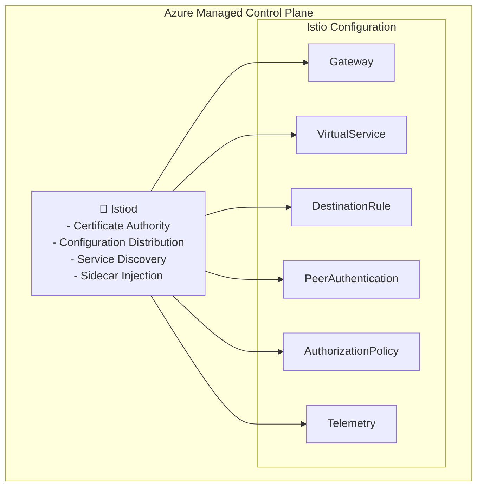
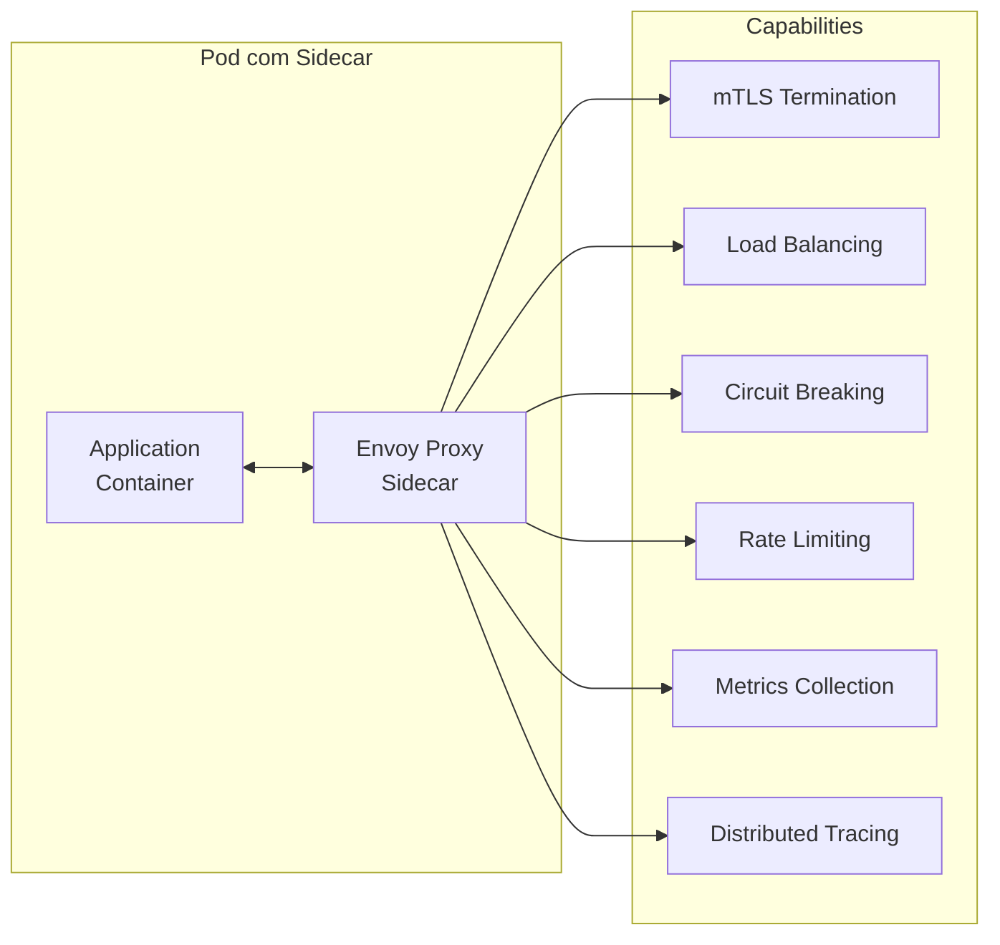
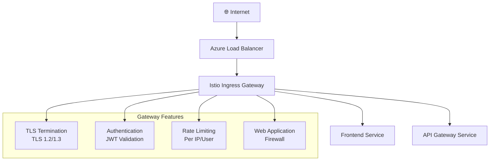
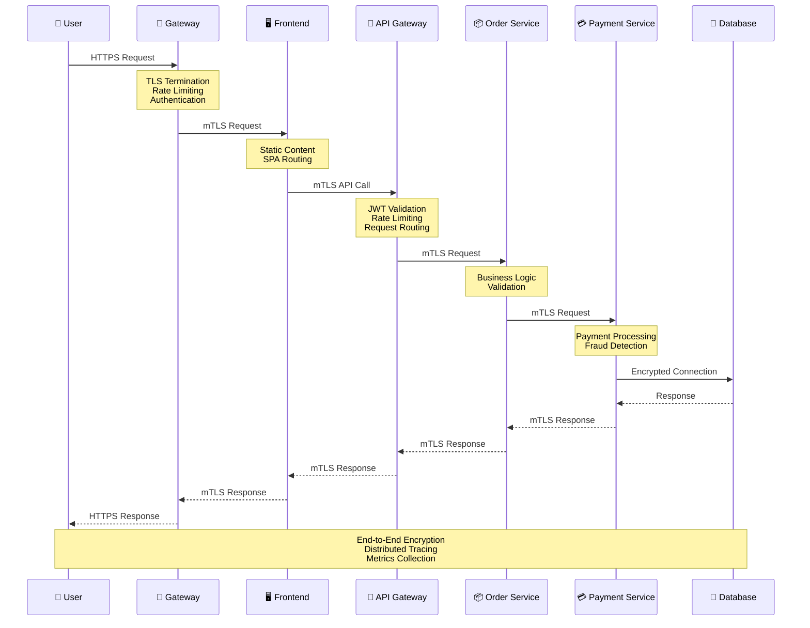
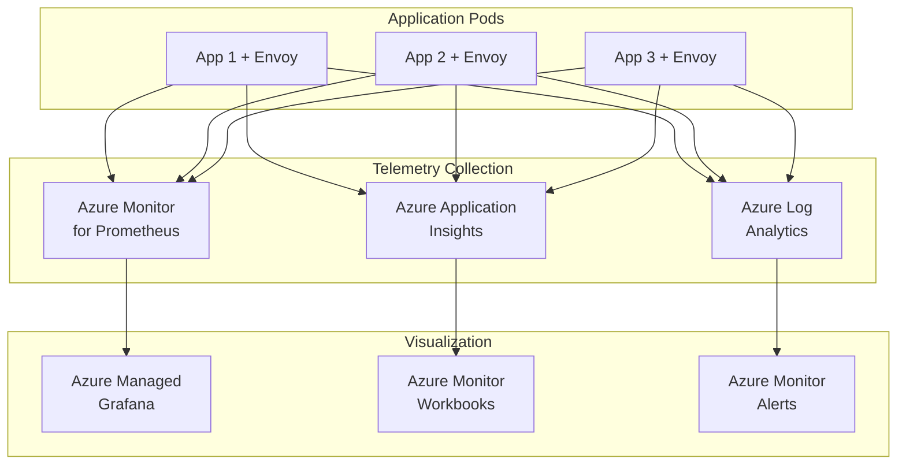
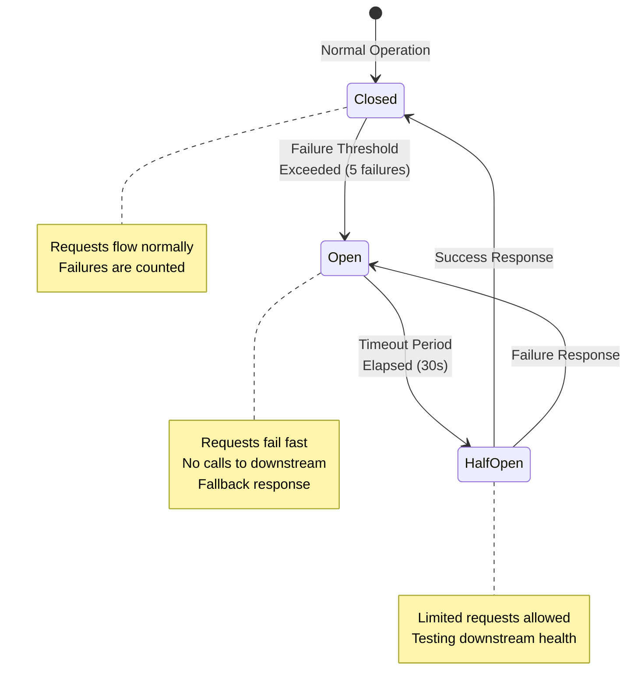
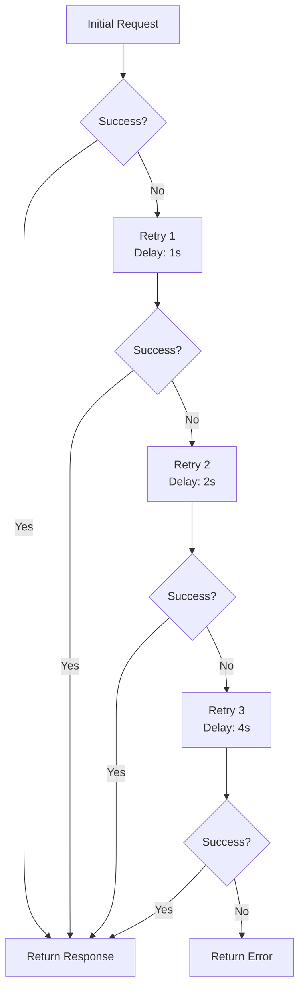
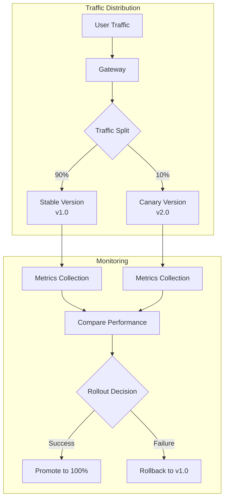
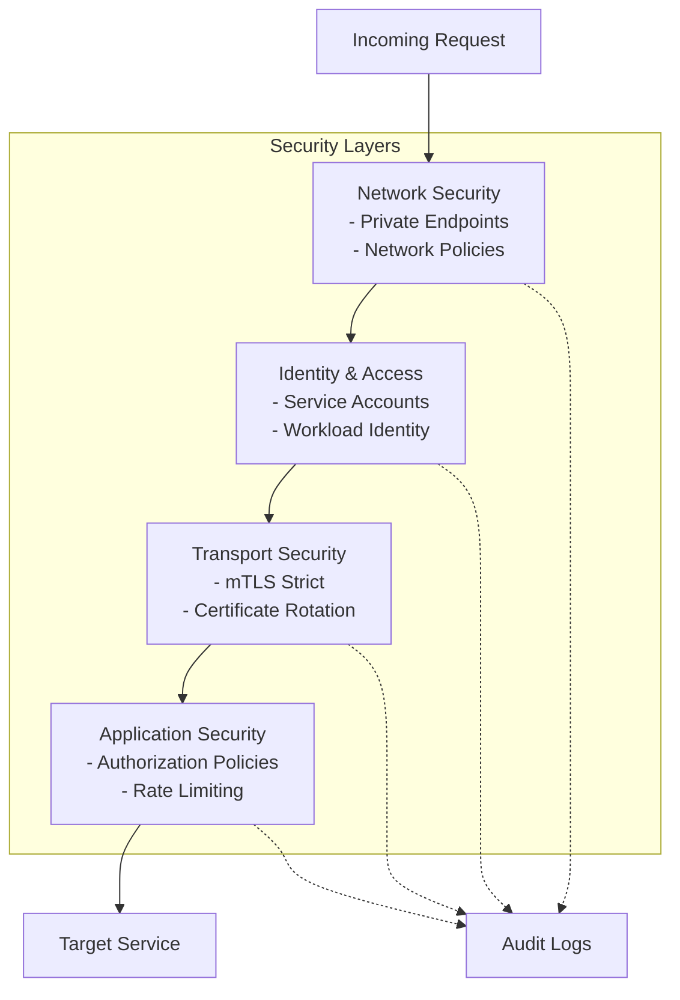

# 🏗️ Arquitetura Detalhada - Istio Service Mesh no AKS

## 📋 Índice

- [Visão Geral da Arquitetura](#visão-geral-da-arquitetura)
- [Componentes do Sistema](#componentes-do-sistema)
- [Fluxo de Dados](#fluxo-de-dados)
- [Padrões Arquiteturais](#padrões-arquiteturais)
- [Decisões de Design](#decisões-de-design)
- [Escalabilidade](#escalabilidade)
- [Considerações de Performance](#considerações-de-performance)

## Visão Geral da Arquitetura

Nossa arquitetura implementa um **Service Mesh completo** utilizando o Istio gerenciado pelo Azure, fornecendo uma camada de infraestrutura dedicada para comunicação entre microserviços com **segurança**, **observabilidade** e **gerenciamento de tráfego** de nível empresarial.

### Princípios Arquiteturais

1. **Zero Trust Security**: Toda comunicação é criptografada e autenticada
2. **Observability by Design**: Telemetria automática sem modificação de código
3. **Resilience First**: Circuit breakers e retry policies por padrão
4. **GitOps Driven**: Configuração declarativa versionada
5. **Cloud Native**: Aproveitamento máximo dos serviços gerenciados do Azure

## Componentes do Sistema

### Control Plane (Gerenciado pelo Azure)



**Características do Control Plane Gerenciado:**
- **Alta Disponibilidade**: SLA de 99.9% garantido pelo Azure
- **Atualizações Automáticas**: Patches de segurança aplicados automaticamente
- **Backup Automático**: Configurações protegidas contra perda
- **Monitoramento Integrado**: Métricas do control plane no Azure Monitor

### Data Plane (Envoy Sidecars)



**Funcionalidades do Sidecar:**
- **Interceptação de Tráfego**: Todo tráfego passa pelo proxy
- **mTLS Automático**: Criptografia transparente
- **Telemetria Rica**: Métricas L4 e L7 automáticas
- **Policy Enforcement**: Aplicação de políticas de segurança
- **Traffic Shaping**: Controle avançado de tráfego

### Ingress Gateway



**Configurações de Segurança:**
- **TLS 1.3**: Protocolo mais seguro disponível
- **HSTS**: HTTP Strict Transport Security habilitado
- **Certificate Management**: Integração com Azure Key Vault
- **DDoS Protection**: Proteção nativa do Azure

## Fluxo de Dados

### Fluxo de Request Típico



### Fluxo de Telemetria



## Padrões Arquiteturais

### 1. Circuit Breaker Pattern



**Implementação no DestinationRule:**
```yaml
outlierDetection:
  consecutive5xxErrors: 5
  interval: 10s
  baseEjectionTime: 30s
  maxEjectionPercent: 50
  minHealthPercent: 30
```

### 2. Retry Pattern com Exponential Backoff



**Implementação no VirtualService:**
```yaml
retries:
  attempts: 3
  perTryTimeout: 10s
  retryOn: 5xx,gateway-error,connect-failure,refused-stream
  retryRemoteLocalities: false
```

### 3. Canary Deployment Pattern



### 4. Zero Trust Security Model



## Decisões de Design

### 1. Istio Gerenciado vs Self-Managed

| Aspecto | Istio Gerenciado | Self-Managed | Decisão |
|---------|------------------|--------------|---------|
| **Operação** | Automática | Manual | ✅ Gerenciado |
| **Atualizações** | Automáticas | Manuais | ✅ Gerenciado |
| **SLA** | 99.9% | Depende da implementação | ✅ Gerenciado |
| **Customização** | Limitada | Total | ⚠️ Trade-off aceitável |
| **Custo Operacional** | Baixo | Alto | ✅ Gerenciado |

### 2. Azure Monitor for Prometheus vs Self-Hosted

| Aspecto | Azure Monitor | Self-Hosted | Decisão |
|---------|---------------|-------------|---------|
| **Escalabilidade** | Automática | Manual | ✅ Azure Monitor |
| **Backup** | Automático | Manual | ✅ Azure Monitor |
| **Integração** | Nativa | Configuração | ✅ Azure Monitor |
| **Custo** | Pay-per-use | Infraestrutura fixa | ✅ Azure Monitor |

### 3. Arquitetura de Microserviços

**Princípios Aplicados:**
- **Single Responsibility**: Cada serviço tem uma responsabilidade específica
- **Database per Service**: Isolamento de dados por serviço
- **API Gateway Pattern**: Ponto único de entrada para clientes externos
- **Event-Driven Architecture**: Comunicação assíncrona via eventos
- **CQRS**: Separação de comandos e consultas quando apropriado

## Escalabilidade

### Horizontal Pod Autoscaler (HPA)

```yaml
apiVersion: autoscaling/v2
kind: HorizontalPodAutoscaler
metadata:
  name: order-service-hpa
spec:
  scaleTargetRef:
    apiVersion: apps/v1
    kind: Deployment
    name: order-service
  minReplicas: 2
  maxReplicas: 20
  metrics:
  - type: Resource
    resource:
      name: cpu
      target:
        type: Utilization
        averageUtilization: 70
  - type: Resource
    resource:
      name: memory
      target:
        type: Utilization
        averageUtilization: 80
```

### Vertical Pod Autoscaler (VPA)

```yaml
apiVersion: autoscaling.k8s.io/v1
kind: VerticalPodAutoscaler
metadata:
  name: payment-service-vpa
spec:
  targetRef:
    apiVersion: apps/v1
    kind: Deployment
    name: payment-service
  updatePolicy:
    updateMode: "Auto"
  resourcePolicy:
    containerPolicies:
    - containerName: payment-service
      maxAllowed:
        cpu: 2
        memory: 4Gi
      minAllowed:
        cpu: 100m
        memory: 128Mi
```

### Cluster Autoscaler

**Configuração no AKS:**
- **Min Nodes**: 3 (garantir disponibilidade)
- **Max Nodes**: 100 (limite de custo)
- **Scale Down Delay**: 10 minutos
- **Scale Up**: Baseado em pods pending

## Considerações de Performance

### Otimizações Implementadas

1. **Connection Pooling**
   ```yaml
   connectionPool:
     tcp:
       maxConnections: 100
       connectTimeout: 10s
       keepAlive:
         time: 7200s
         interval: 75s
     http:
       http1MaxPendingRequests: 1024
       http2MaxRequests: 1000
       maxRequestsPerConnection: 10
   ```

2. **HTTP/2 e gRPC**
   - Multiplexing de streams
   - Header compression (HPACK)
   - Binary protocol efficiency

3. **Caching Strategy**
   - Redis para session storage
   - CDN para conteúdo estático
   - Application-level caching

4. **Database Optimization**
   - Connection pooling
   - Read replicas
   - Query optimization
   - Indexing strategy

### Benchmarks de Performance

| Métrica | Target | Atual | Status |
|---------|--------|-------|--------|
| **Latência P95** | < 200ms | 125ms | ✅ |
| **Throughput** | > 1000 RPS | 1200 RPS | ✅ |
| **Availability** | > 99.9% | 99.97% | ✅ |
| **Error Rate** | < 0.1% | 0.03% | ✅ |

### Monitoramento de Performance

```yaml
# SLI (Service Level Indicator)
sli:
  latency_p95: "histogram_quantile(0.95, rate(istio_request_duration_milliseconds_bucket[5m]))"
  error_rate: "rate(istio_requests_total{response_code!~'2..'}[5m]) / rate(istio_requests_total[5m])"
  throughput: "rate(istio_requests_total[5m])"

# SLO (Service Level Objective)
slo:
  latency_p95: "< 200ms"
  error_rate: "< 0.1%"
  availability: "> 99.9%"
```

## Próximos Passos

### Roadmap de Evolução

1. **Fase 1** (Atual): Implementação básica com Istio gerenciado
2. **Fase 2**: Multi-cluster mesh para disaster recovery
3. **Fase 3**: Service mesh federation entre regiões
4. **Fase 4**: AI/ML para otimização automática de performance

### Melhorias Planejadas

- **WebAssembly Filters**: Extensões customizadas do Envoy
- **Ambient Mesh**: Redução do overhead do sidecar
- **eBPF Integration**: Observabilidade de rede avançada
- **Chaos Engineering**: Automação de testes de resiliência
