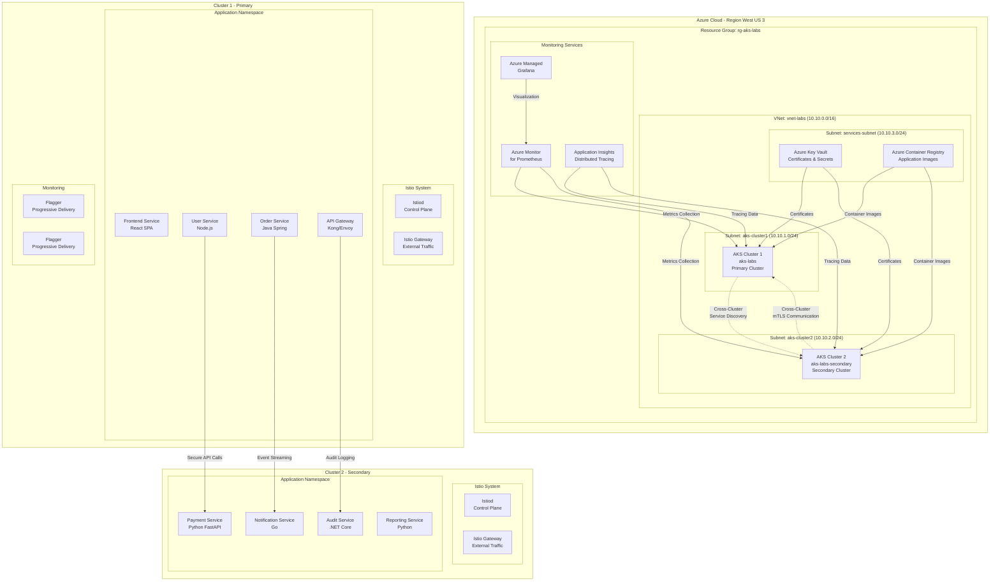
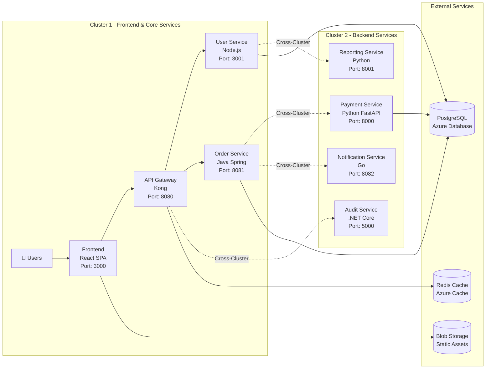

# 🏗️ Laboratório Multi-Cluster Istio AKS - Plano Mestre

## 📋 Visão Geral do Laboratório

Este laboratório demonstra uma **arquitetura de Service Mesh multi-cluster** de nível empresarial usando Istio gerenciado no Azure Kubernetes Service (AKS), com foco em:

- **Comunicação Cross-Cluster** segura e observável
- **Zero Trust Security** com mTLS STRICT
- **Observabilidade Avançada** com Prometheus/Grafana gerenciados
- **Estratégias de Deployment** automatizadas com Flagger
- **Aplicação de Demonstração** complexa e realística

## 🎯 Objetivos Específicos

### 1. **Identificar Limitações do Istio Gerenciado**
- [ ] Mapear features não disponíveis no contexto gerenciado
- [ ] Documentar workarounds para limitações identificadas
- [ ] Avaliar impacto nas arquiteturas empresariais

### 2. **Implementar Comunicação Cross-Cluster**
- [ ] Configurar malha de serviços multi-cluster
- [ ] Testar descoberta de serviços entre clusters
- [ ] Validar balanceamento de carga cross-cluster
- [ ] Medir impactos de performance e latência

### 3. **Demonstrar Segurança Zero Trust**
- [ ] Implementar mTLS STRICT em ambos os clusters
- [ ] Configurar políticas de autorização granulares
- [ ] Integrar com Azure AD para autenticação externa
- [ ] Gerenciar certificados com Azure Key Vault

### 4. **Estabelecer Observabilidade Completa**
- [ ] Configurar Prometheus gerenciado para ambos os clusters
- [ ] Implementar dashboards Grafana personalizados
- [ ] Configurar distributed tracing cross-cluster
- [ ] Estabelecer alertas baseados em SLOs

### 5. **Automatizar Estratégias de Deployment**
- [ ] Implementar Canary deployments com Flagger
- [ ] Configurar rollbacks automáticos baseados em métricas
- [ ] Testar Blue/Green deployments cross-cluster
- [ ] Validar A/B testing com roteamento inteligente

## 🏗️ Arquitetura do Laboratório



## 📊 Aplicação de Demonstração: E-Commerce Platform

### Arquitetura de Microserviços



### Fluxos de Comunicação Cross-Cluster

1. **User Registration Flow**
   - Frontend → API Gateway → User Service
   - User Service → Audit Service (Cross-Cluster)
   - Audit Service → Reporting Service

2. **Order Processing Flow**
   - Frontend → API Gateway → Order Service
   - Order Service → Payment Service (Cross-Cluster)
   - Payment Service → Notification Service (Cross-Cluster)

3. **Monitoring & Observability Flow**
   - All services → Prometheus (Metrics)
   - All services → Application Insights (Traces)
   - Flagger → Prometheus (Deployment Metrics)

## 🔒 Estratégia de Segurança Zero Trust

### 1. **mTLS Configuration**
```yaml
# Global mTLS Policy
apiVersion: security.istio.io/v1beta1
kind: PeerAuthentication
metadata:
  name: default
  namespace: istio-system
spec:
  mtls:
    mode: STRICT
```

### 2. **Cross-Cluster Certificate Management**
- **Root CA**: Azure Key Vault managed
- **Intermediate CAs**: Per-cluster Istio CA
- **Workload Certificates**: Auto-rotated every 24h
- **Cross-Cluster Trust**: Shared root CA bundle

### 3. **Authorization Policies**
```yaml
# Example: Order Service can only call Payment Service
apiVersion: security.istio.io/v1beta1
kind: AuthorizationPolicy
metadata:
  name: payment-service-policy
  namespace: ecommerce
spec:
  selector:
    matchLabels:
      app: payment-service
  rules:
  - from:
    - source:
        principals: ["cluster.local/ns/ecommerce/sa/order-service"]
  - to:
    - operation:
        methods: ["POST"]
        paths: ["/api/payments/*"]
```

## 📈 Observabilidade e Monitoramento

### Métricas Coletadas

#### **Business Metrics**
- Order conversion rate
- Payment success rate
- User registration funnel
- Cross-cluster latency

#### **Technical Metrics**
- Request rate (RPS)
- Error rate (4xx, 5xx)
- Response time (P50, P95, P99)
- Resource utilization (CPU, Memory)

#### **Istio Metrics**
- mTLS success rate
- Service mesh topology
- Circuit breaker activations
- Retry attempts

### Dashboards Grafana

1. **Service Mesh Overview**
   - Global topology view
   - Cross-cluster communication health
   - mTLS certificate status

2. **Application Performance**
   - Business KPIs
   - Service-level SLIs/SLOs
   - Error budget tracking

3. **Infrastructure Health**
   - Cluster resource utilization
   - Node health status
   - Network performance

## 🚀 Estratégias de Deployment

### 1. **Canary Deployment com Flagger**
```yaml
apiVersion: flagger.app/v1beta1
kind: Canary
metadata:
  name: payment-service
  namespace: ecommerce
spec:
  targetRef:
    apiVersion: apps/v1
    kind: Deployment
    name: payment-service
  progressDeadlineSeconds: 60
  service:
    port: 8000
    targetPort: 8000
  analysis:
    interval: 30s
    threshold: 5
    maxWeight: 50
    stepWeight: 10
    metrics:
    - name: request-success-rate
      thresholdRange:
        min: 99
    - name: request-duration
      thresholdRange:
        max: 500
```

### 2. **Cross-Cluster Blue/Green**
- **Blue Environment**: Cluster 1
- **Green Environment**: Cluster 2
- **Traffic Switching**: Istio Gateway + VirtualService
- **Rollback Strategy**: Automated based on SLOs

### 3. **A/B Testing**
- **User Segmentation**: Headers, Geography, User Type
- **Traffic Splitting**: Percentage-based routing
- **Metrics Collection**: Conversion rates, user behavior

## 🧪 Cenários de Teste

### 1. **Functional Tests**
- [ ] Cross-cluster service discovery
- [ ] mTLS certificate validation
- [ ] Authorization policy enforcement
- [ ] Load balancing across clusters

### 2. **Performance Tests**
- [ ] Cross-cluster latency measurement
- [ ] Throughput under load
- [ ] Resource utilization impact
- [ ] Network bandwidth consumption

### 3. **Chaos Engineering**
- [ ] Cluster failure simulation
- [ ] Network partition testing
- [ ] Certificate expiration scenarios
- [ ] Service degradation handling

### 4. **Security Tests**
- [ ] mTLS bypass attempts
- [ ] Authorization policy violations
- [ ] Certificate tampering detection
- [ ] Cross-cluster attack vectors

## 📚 Entregáveis do Laboratório

### 1. **Infraestrutura**
- [ ] Scripts de criação do segundo cluster
- [ ] Configuração de rede cross-cluster
- [ ] Setup de monitoramento integrado
- [ ] Configuração de segurança completa

### 2. **Aplicação**
- [ ] Código-fonte dos microserviços
- [ ] Manifestos Kubernetes
- [ ] Configurações Istio
- [ ] Pipelines CI/CD

### 3. **Documentação**
- [ ] Tutorial passo-a-passo detalhado
- [ ] Guia de troubleshooting
- [ ] Melhores práticas identificadas
- [ ] Limitações e workarounds

### 4. **Automação**
- [ ] Scripts de deployment
- [ ] Configuração de monitoramento
- [ ] Testes automatizados
- [ ] Rollback procedures

## 🎯 Critérios de Sucesso

### **Funcionalidade**
- ✅ Comunicação cross-cluster funcionando
- ✅ mTLS STRICT aplicado e validado
- ✅ Observabilidade completa implementada
- ✅ Estratégias de deployment testadas

### **Performance**
- ✅ Latência cross-cluster < 50ms (P95)
- ✅ Throughput > 1000 RPS por serviço
- ✅ Overhead do Istio < 10% CPU/Memory
- ✅ Disponibilidade > 99.9%

### **Segurança**
- ✅ Zero comunicação não-criptografada
- ✅ Políticas de autorização aplicadas
- ✅ Certificados rotacionados automaticamente
- ✅ Auditoria completa implementada

### **Operabilidade**
- ✅ Deployment automatizado
- ✅ Monitoramento proativo
- ✅ Rollback em < 2 minutos
- ✅ Troubleshooting documentado

## 📅 Cronograma de Execução

### **Fase 1: Preparação (1-2 horas)**
1. Criação do segundo cluster AKS
2. Configuração de rede e conectividade
3. Setup de monitoramento base

### **Fase 2: Aplicação (2-3 horas)**
1. Deploy dos microserviços
2. Configuração do Istio
3. Implementação de segurança

### **Fase 3: Integração (1-2 horas)**
1. Configuração cross-cluster
2. Testes de conectividade
3. Validação de segurança

### **Fase 4: Observabilidade (1 hora)**
1. Setup de dashboards
2. Configuração de alertas
3. Testes de monitoramento

### **Fase 5: Automação (1-2 horas)**
1. Implementação do Flagger
2. Testes de deployment
3. Validação de rollback

### **Fase 6: Validação (1 hora)**
1. Testes end-to-end
2. Performance testing
3. Documentação final

---

**Total Estimado: 7-11 horas de trabalho técnico especializado**

Este plano garante uma execução sistemática e organizada, evitando retrabalho e maximizando a qualidade técnica do laboratório.
